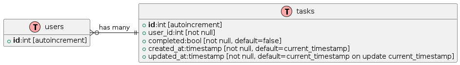

= Cloud computing and services 
:toc:
:toc-title: Table of contents 

:source-language: yaml

.Lab exercise - Docker & Microservices 

[NOTE]
****
[.text-center]

****

== Students 

* Μάριος Παπάζογλου ~ ice21390179
* Αικατερίνη Παπαχριστούλου ~ ice19390185

== Intro

=== Application description 
Todo-guru is a microservice application built using Go as the API backend and MariaDB as the database management system. 
It provides a very simple API for creating and managing todo items and user management functionality. 
This allows users to create accounts, login, and manage their own todo items.

=== Installation

* Install [Docker](https://docs.docker.com/engine/install/)
* Install [Docker compose](https://docs.docker.com/compose/install/)
* Check link:./INSTALL.adoc[INSTALL.adoc]

== Chapter 1: Building the CLIENT

The client is an essential component of our application, as it provides the interface through which users can interact with our system. 
It can take many forms, ranging from a traditional web interface to a command-line interface (CLI) or even a mobile app.

In our case, we made a basic web app using Svelte a new minimal framework.

== Chapter 2: Building the API

Our API is built using the powerful and lightweight chi router,
which is a popular minimalist choice. We will be creating several endpoints that allow users to interact with our application,
including the ability to register, log in, create, delete and update tasks.

image::https://katcipis.github.io/img/gohacking.jpg[width=40%, align=center]

Our API is designed to be efficient and scalable, with a focus on simplicity and ease of use. The use of HTTP methods such as POST, DELETE, PATCH, and GET 
allow for clear and concise communication between the client and the server, while maintaining RESTful principles.

[source, go]
----
r.Route("/api", func(r chi.Router) {
    r.Post("/register", RegisterHandler(db))
    r.Post("/login", LoginHandler(db))
    r.Post("/create_task", CreateTask(db))
    r.Delete("/delete_task", DeleteTask(db))
    r.Patch("/update_task", UpdateTask(db))
    r.Get("/gather_tasks", GatherTasks(db))
    r.Get("/", func(w http.ResponseWriter, _ *http.Request) {
        w.Header().Set("Content-Type", "application/json")
        w.WriteHeader(http.StatusOK)
        w.Write([]byte("Hello World"))
    })
})
----

In the code block above, you can see how we use the chi.Router to define our endpoints. We use r.Post to handle the registration, login, 
and task creation endpoints, r.Delete to handle task deletion, r.Patch to handle task updates, and r.Get to handle task retrieval.
We also define a simple Hello World endpoint for health check. The db object is passed as a parameter to each of the handlers, allowing them to interact with the database.

By using the chi router, we can easily define our endpoints and map them to the appropriate handlers, keeping our code organized and easy to maintain.

== Chapter 3: Building the Database

The application uses a MariaDB as storage. MariaDB is a FOSS (Free and Open Source Software) community-driven fork of the MySQL, 
providing a more minimal and faster alternative to its predecessor.

to initialize the database you need the script below 

[source, sql]
----

CREATE DATABASE IF NOT EXISTS tododb;

USE tododb;

GRANT SELECT, INSERT, UPDATE, DELETE ON tododb.* TO 'user'@'%';

CREATE TABLE IF NOT EXISTS users (
    id INT AUTO_INCREMENT PRIMARY KEY,
    username VARCHAR(255) UNIQUE NOT NULL,
    password VARCHAR(255) NOT NULL,
    INDEX idx_username (username)
);

CREATE TABLE IF NOT EXISTS tasks (
    id INT AUTO_INCREMENT PRIMARY KEY,
    user_id INT NOT NULL,
    description VARCHAR(255) NOT NULL,
    completed BOOL NOT NULL DEFAULT false,
    created_at TIMESTAMP NOT NULL DEFAULT CURRENT_TIMESTAMP,
    updated_at TIMESTAMP NOT NULL DEFAULT CURRENT_TIMESTAMP ON UPDATE CURRENT_TIMESTAMP,
    INDEX idx_user_id (user_id),
    FOREIGN KEY (user_id) REFERENCES users(id) ON DELETE CASCADE
);
----

== Chapter 4: Integrating the components 

To integrate these components, we are using the chi router to create endpoints that map to API routes. 
Each endpoint will call a handler function that interacts with the database using SQL queries. The API endpoints will also return JSON data to the client.

== Chapter 5: Compose the services 

Our application has 3 Dockerfiles for each of its services, api, database and web. They were all written based on the official documentation and the examples our professor provided us. 

* [Official documentation](https://docs.docker.com/engine/reference/builder/)
* [Example 1](https://nodejs.org/en/docs/guides/nodejs-docker-webapp)
* [Example 2](https://github.com/bbachi/dockerfile-examples)

Below is an example of the Dockerfile of our api which creates its necessary Docker image: 

[source, Dockerfile]
----
FROM golang:1.20.3-alpine3.17 

WORKDIR /app

COPY go.mod .

COPY go.sum .

RUN go mod download

COPY . . 

RUN go build -o todo-api

EXPOSE 8080

ENTRYPOINT [ "./todo-api" ]
----

For all our services we used the docker image golang:1.20.3-alpine3.17 and the main working directory /app. We then composed the services in a docker-compose file. 

* [Official documentation](https://docs.docker.com/compose/)

Inside the docker-compose file we can see that our application uses its own network, the cloudlab-network. 

[source, yaml]
----
...
networks:
  cloudlab-network:

  ....
----

The file also includes the three services as mentioned above. Below is a snippet of the web service in the compose file:

[source, yaml]
----
web:
    build: web
    hostname: web
    container_name: todo-web
    restart: on-failure
    ports:
      - "3000:3000"
    networks:
      - cloudlab-network
    depends_on:
      - mariadb
      - api 
    mem_limit: 128M
----

Lastly, we made the necessary configurations in our compose file so the containers don't consume too much of the host machine's memory. This was done with the mem_limit flag. Our web container now 
uses only 128Mb, our api 64Mb and our database 1Gb of memory. 
